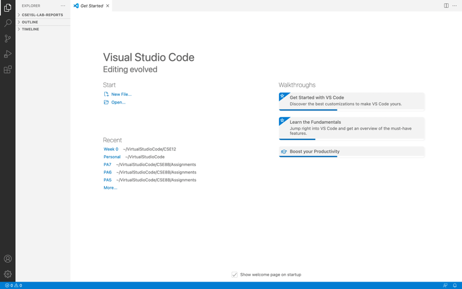
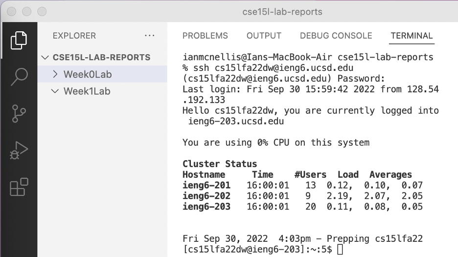
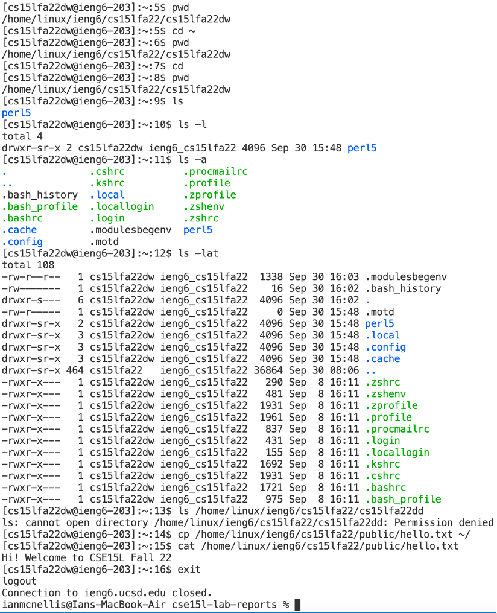
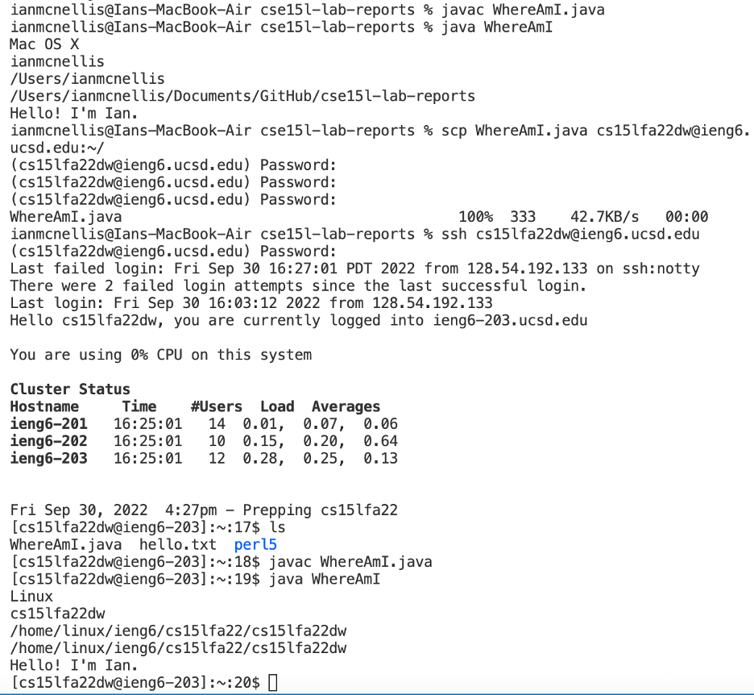
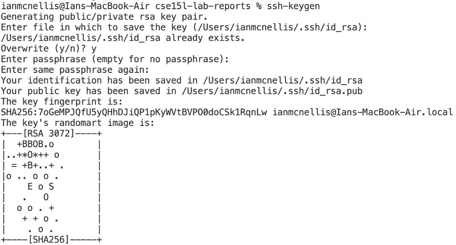
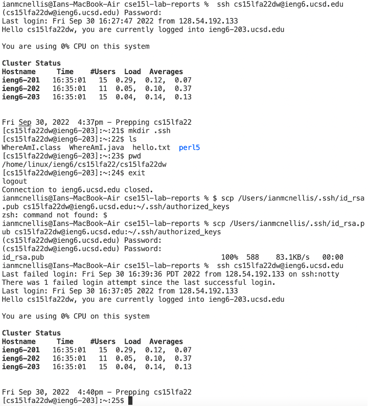
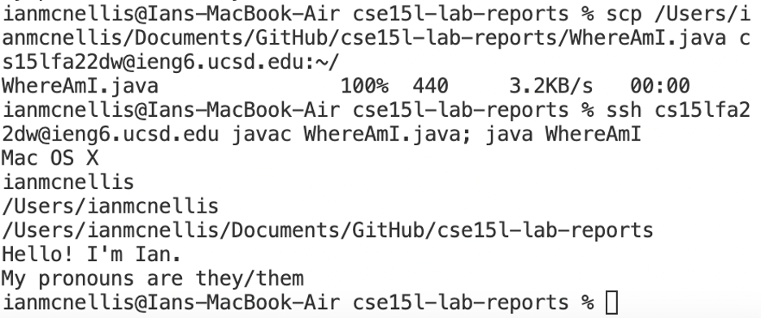

**Week 1 Lab Report**

*Part 3: Installing VSCode*

I already had vscode installed on my computer, hence the CSE15-LAB-REPORTS folder, but here is the get started page.

*Part 4: Remotely Connecting*

After changing my password a second time, I was finally able to log into the server account.

To do so, I used the ssh command, and entered my password.
 

 

*Part 5: Run Some Commands*

First I ran the pwd command to check my current directory, and I did the same after using the different cd commands to see if my directory would change.

Then I used the ls command, as well as the ls -l, ls -a, and ls -lat commands. With each added letter, more files were shown.

Then I tried to access another classmate's directory with ls, but access was denied.

Finally, I used the cp function to copy a file from a public directory and the cat function to print its contents.

 

*Part 6: Moving Files Over*

First, I copied the WhereAmI code into a file, then compiled and ran it on my own computer, then I used the scp command to copy it into my server account.

Then, I logged into my server account and compiled and ran the file.

It took me 2 minutes and 24 seconds to change a file and move it while having to manually enter my password.

 
*Part 7: Setting SSH Key*

First, I created a key on my computer. I had to overwrite an existing one because I created one in the lab to access a TA’s server account, as mine was not working.
 

Next, I made a directory in my server account, and used the scp command to share key information from my computer to the server account.

After successfully doing so, I was able to access the server using the ssh command without entering my password.
 

After repeating the timed experiment, I was able to get a time of 2 minutes instead of 2 minutes and 20 seconds per the first run. (It could have been even smaller but I made many mistakes in typing commands)
 

*Step 8: Optimizing Remote Running*

I utilized the convenience of the access key as well as the ability to put multiple commands in the same line to minimize the amount of steps it took to copy over and access a file.
 

I was able to perform the copy task in 5 keystrokes. I did this by typing out the commands in one run. Then, I used the up arrow key to call the past actions. I imagine this would be extremely handy in a scenario where I need to make quick changes to a file and then upload the changes to a server.
