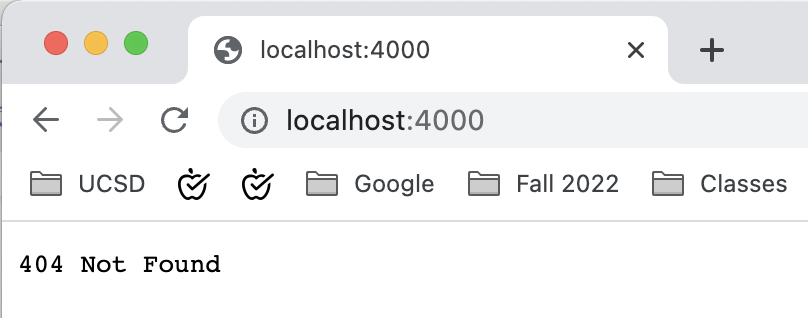
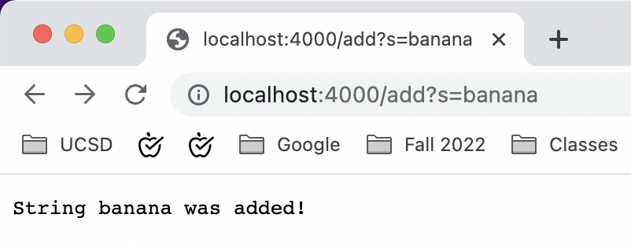
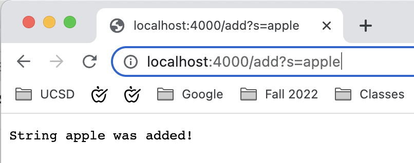
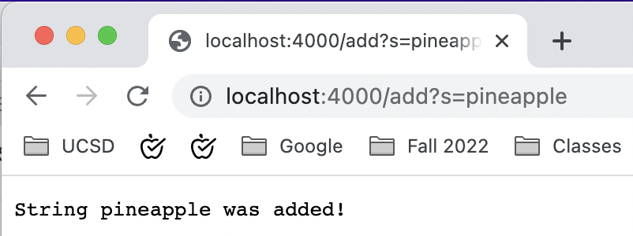
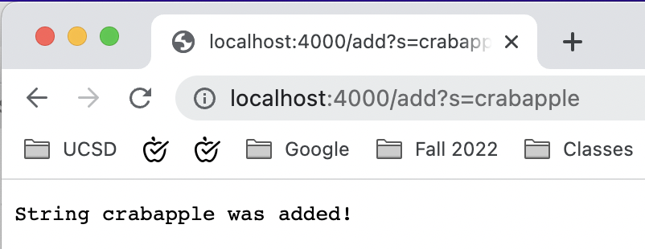
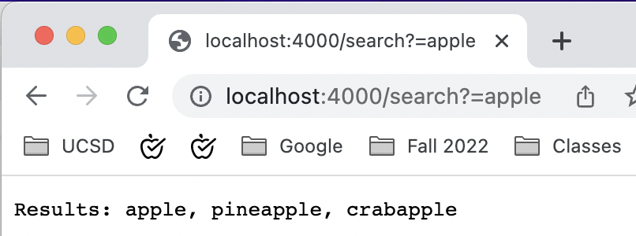
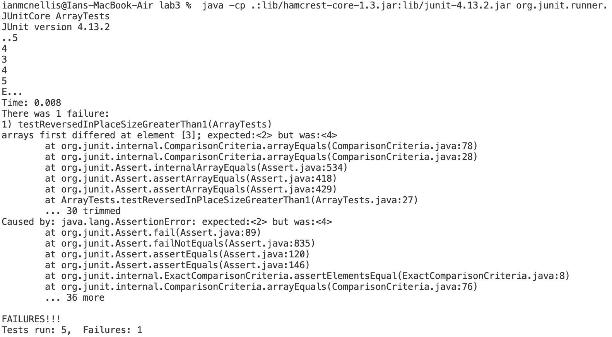
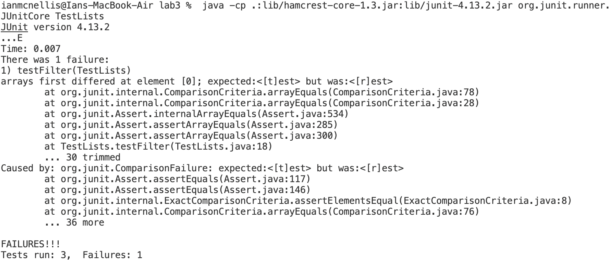

**Week 3 Lab Report**
<br/>
<br/>
**Part 1:** *Simplest Search Engine:*

Below is my code for implementing the simple search engine.

```
import java.io.IOException;
import java.net.URI;
import java.util.ArrayList;

class Handler implements URLHandler {
    // The one bit of state on the server: a number that will be manipulated by
    // various requests.
    ArrayList<String> strList = new ArrayList<>();

    public String handleRequest(URI url) {
        if (url.getPath().equals("/search")) {
            String[] searchParameters = url.getQuery().split("=");
            String returnString = "";
            for (int i = 0; i < strList.size(); i++) {
                if(searchParameters[0].equals("s")) {
                    if (strList.get(i).contains(searchParameters[1])) {
                        if (i < (strList.size()-1)) {
                            returnString += strList.get(i) + ", ";
                        } else if (i == (strList.size()-1)) {
                            returnString += strList.get(i);
                        }
                    }
                }
                else {return "404 Not Found";}
            }
            return String.format("Results: %s", returnString);
        } else if (url.getPath().contains("/add")) {
                String[] stringParameters = url.getQuery().split("=");
                if (stringParameters[0].equals("s")) {
                    strList.add(stringParameters[1]);
                    return String.format("String %s was added!", stringParameters[1]);
                }
                return "404 Not Found!";
        } else { return "404 Not Found"; }
    }
}

class SearchEngine {
    public static void main(String[] args) throws IOException {
        if(args.length == 0){
            System.out.println("Missing port number! Try any number between 1024 to 49151");
            return;
        }

        int port = Integer.parseInt(args[0]);

        Server.start(port, new Handler());
    }
}

```
<br/>



Here is the "homepage' of the server. There is a "404 Not Found" message on the page because I did not program my server to process website address arguments where the path is invalid or nonexistent.
<br/>



Here is the page after passing `/add?s=banana` into the address bar. The `/add` portion of this address is the path, and it signals to my server that something will be added to it's store of strings. the `?s=banana` portion of the address is the query, and it contains more specific instructions about what will be added. The query is split in 2 parts at the equals sign. The `s` before the equals sign serves as a signifier to make it more clear that a string is being added. The `banana` portion of the query is the string that is added, and it is stored in an ArrayList by the program.
<br/>
The next 3 screenshots follow the same exact process, with the only thing changing being the string argument to the right of the equals sign in the query portion of the address argument.
<br/>



The input is `/add?s=apple`. The string "apple" is stored in the server.
<br/>



The input is `/add?s=pineapple`. The string "pineapple" is stored in the server.
<br/>



The input is `/add?s=crabapple` The string "crabapple" is stored in the server.
<br/>



Here is the page after passing `/search?s=apple` into the address bar. The `/search` portion is the path, and it signals to my program that it will need to search its store of strings to see if they contain the following arguments in the query. The `?s=apple` portion of the address is the query. Once again, the query is split at the equal sign to be processed by the program. The `s` before the equals sign once again serves to makes it easier to visualize that a string is going to be added. The `apple` after the equal sign is the string that will be searched for by the program, which it accomplishes by using the ArrayList contains(). We can be positive that the search method works as intended because strings outside the scope of the seach argument were not included in the results.

<br/>
<br/>

**Part 2:** *Bugfixing:*
<br/>
<br/>
From ArrayExamples: 

*reverseInPlace*

The failure inducing input: `{1,2,3,4,5}`

The symptom of this bug was that when printing out the contents of an array after calling reverseInPlace on it, the first half of the list seemed to correctly copy values from the other half, but the second half of the list did not.


<br/>

The reverseInPlace method reassigns the values of earlier indices to the values of later indices, but does not reassign the values of the later indices to those of the earlier ones. Additionally, the loop runs for longer than is necessary, because only half of the array indices need to be traversed for all of the array to be covered. 

This can be fixed by storing the value of `arr[i]` so that the value can be assigned to later indices, and by reducing the number of loops. These changes are shown below. The `arr[i]` value is held in the `store` variable, and later indices are reassigned to the `store` value. Additionally, the bounds of iteration are changed in the `for` statement through `length/2 ` to make it so that only half of the array is iterated through.

```
static void reverseInPlace(int[] arr) {
  for(int i = 0; i < arr.length/2; i += 1) {
    int store = arr[i];
    arr[i] = arr[arr.length - i - 1];
    arr[arr.length - i - 1] = store;
  }
}
```
<br/>
<br/>

From ListExamples:

*filter*

In order to successfully test the filter method, I created a class to extend the StringChecker interface. My implementation of the interface is shown below:
```
class VowelChecker implements StringChecker {
  public boolean checkString(String s) {
    char[] vowels = {'a','e','i','o','u'};
    int vowelCount = 0; 
    for (int i = 0; i < s.length(); i++) {
      char cha = s.charAt(i);
      if (cha == 'a' || cha == 'e' || cha == 'i' 
          || cha == 'o' || cha == 'u') {
            vowelCount += 1;
          }
    }
    if (vowelCount >= 2) {return false;}
    return true;
  }
}
```
<br/>
This StringChecker method returns true if the String has 1 or less vowels, and false if the String has 2 or more vowels. After creating this method, I could then test the filter method.
<br/>
<br/>
The failure inducing input was an array list containing the following strings: `{"test","tester","rest","rester"} `

The symptom of this bug was an error message, revealing that words in the array were in the wrong indices.

<br/>

The filter method correctly filters out words, but it does not conserve the order, as specified by the notes above the method. This is likely because when implementing the .add() function, the method includes 0 as the index, so the Strings are always inserted into the beginning of the list, which results in an incorrectly ordered array.

I fixed this by removing the index as an argument in the call of the add method.

```
static List<String> filter(List<String> list, StringChecker sc) {
  List<String> result = new ArrayList<>();
  for(String s: list) {
    if(sc.checkString(s)) {
      result.add(s);
    }
  }
  return result;
}
```


