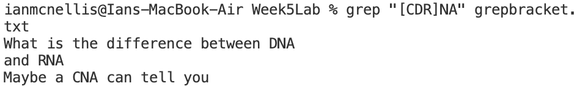

**Week 5 Lab Report**  
*Researching Commands* 

**Find**  
*`-iname`*  
Using `-iname` instead of `-name` allows us to make case insensitive searches for files, which is useful when you have files with different cases but similar characters otherwise. 

 
  
With `-name`, only test.txt is returned, but with `-iname`, all files with test are returned. 
 

*`-mtime`* 
Using `-mtime` allows us to filter files that we've edited within a specific time range, which can be useful if we are trying to find files that we've recently edited. 

 
Using +x, where x is an integer number of days, the find command returns files that were modified within that number of days. 

*`-delete`* 
Using `-delete` allows us to find and delete files, and can be useful when we want to delete all files of a type or all files containing certain characters. 

Files: 
The files with test in their names are present. 
 

Files after using delete: 
The files with test were deleted and are now gone. 

**Grep** 
*Bracket Arguments* 
Using brackets inside the search argument for `grep` can let us make make single character substitutions so that we don't have to reenter the search argument for a difference of one character. 
File Contents: 
 

 
Calling `[CDR]NA` resulted lines with CNA, DNA, and RNA to be printed without having to use `grep` separately for each of the terms. 

*Before and After Lines* 
Using `-B` and `-A` followed by an integer number of lines allows us to print lines before and after the lines that contain the search argument. This can be useful if we want to find out more specific information within a file without having to manually open it. 
(The same file from bracket arguments is being used.) 
 
Using only `-A` returned the line with RNA and the line after. 
 
Using `-A` and `-B` returned the line with RNA and 1 line before and after. 

*Searching Multiple Strings at a Time* 
Using single quotes, pipes, and backslashes, we can search for multiple strings at a time with one `grep` command.  
 
Using the argument `'DNA\|RNA\|CNA'`, I searched the grepbracket.txt file for all 3 strings at the same time, so it returned all lines that contained at least 1 of the 3 strings. 

**Less** 
*`-N`* 
Using `-N` after `less` allows us to view a file's contents in `less` view with the line numbers included. This can be helpful when we need to browse a document and see the contents at a certain line.
 
After calling `less -N grepbracket.txt` in the terminal, line numbers appeared in the `less` view.

*Searching With Forward Slash* 
Using a forward slash while in the `less` view mode highlights existing instances of the search arguments.  
  
After calling `less grepbracket.txt` and typing `/a` then pressing enter while in `less` view mode, all of the "a" characters are highlighted. 

*Skipping Ahead with `ESC+Space`* 
Using `ESC+Space` while in the `less` view mode skips forward a screen-full of lines, even if there are no more lines left in the document. While this is not the most useful for a document with 3 lines, it would be extremely helpful if you needed to search a large document page by page. 
 
After calling `less grepbracket.txt` and typing `ESC+Space`, the `less` viewer skips forward more lines than there are in the document.

