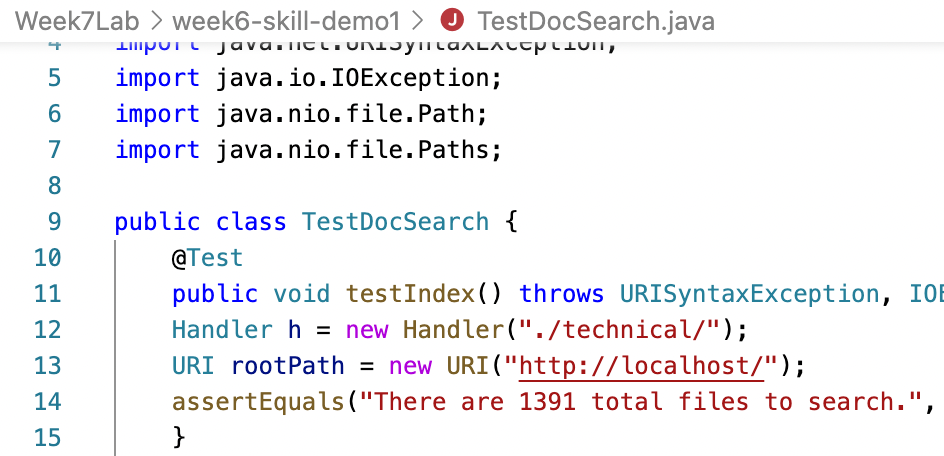
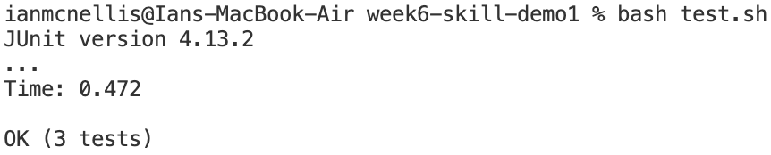
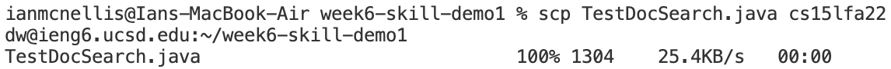
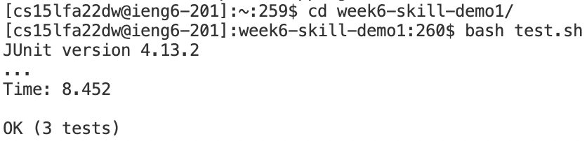
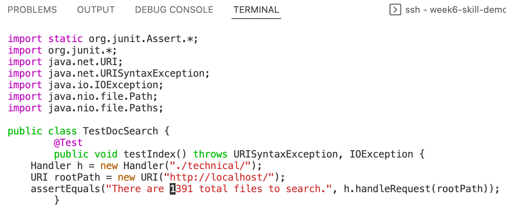
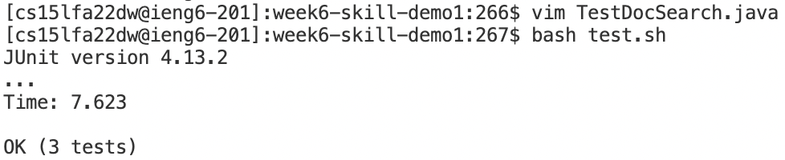

**Week 7 Lab Report**  
*Fixing the Error in TestDocSearch*  

To fix the error in TestDocSearch.java, we need to replace the 10 with 1391. To do this, we pressed the following keys in vim: 
`<Forward-Slash> x x i 1 3 9 1 <Escape> : w q <Enter>`
 
Doing this took a total of 13 keystrokes.  

*Making Changes in VSCode vs. in Vim*  

Making the Changes in VSCode:  
First, I made the edit in vscode and saved the file. 
  
Then, I ran the test file using the script file. 
  
After confirming that the correction was valid and the tests passed, I copied it over to the remote server. 
  
Last, I ran the file remotely to confirm that it worked.  
  

In total, making the changes on VSCode and running the program took 1 minute and 53 seconds. There were no difficulties and everything ran as expected.  

Making the Changes in Vim:  
First, I made the edit in vim and saved the changes.  
  
Then, I ran the test file using the script file and confirmed that the correction was valid and the tests passed.  
  

In total, making the changes on Vim on the remote server took only 54 seconds. There were no difficulties and everthing ran as expected.  

*Ending Questions*  

I generally prefer making edits in VSCode, especially in situations where time is not a constraint, because I personally find it much more comfortable and forgiving to make changes in VSCode or another IDE than to do so in Vim. However, in situations where time is a constraint, or where only small changes are needed, I do not mind using Vim to save time and to make it easier and simpler to make the changes.

